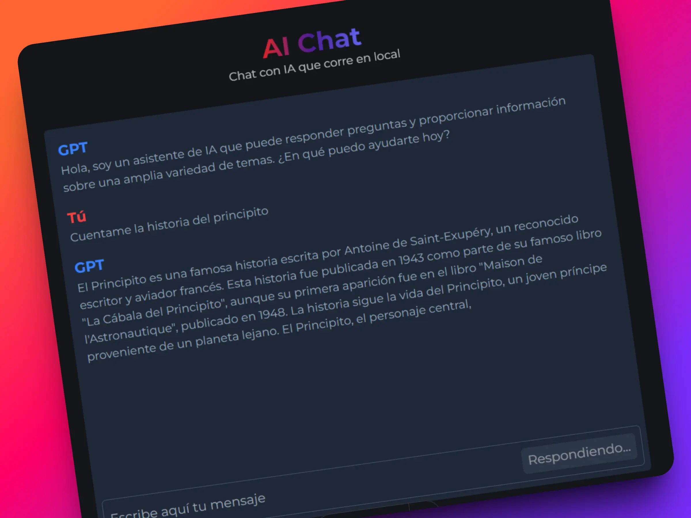

# AI Chat

Chat de IA local, moderno y ligero, construido con Astro y WebLLM. Ejecuta modelos en el navegador, guarda tus conversaciones y no requiere backend.



## ✨ Características

- Chat 100% local en el navegador con WebLLM.
- Selector de modelos con tamaños, velocidad y recomendaciones.
- Historial de conversaciones persistente en `localStorage`.
- Renderizado de Markdown con resaltado de sintaxis.
- Interfaz responsive con sidebar, typing indicator y composición limpia.

## 🧱 Stack

- Astro + TypeScript
- Tailwind CSS v4
- WebLLM (@mlc-ai/web-llm)
- Marked + Shiki para Markdown

## 📁 Estructura del proyecto

```text
/
├── public/
│   ├── ai-chat.webp
│   └── fonts/
├── src/
│   ├── components/
│   ├── layouts/
│   ├── pages/
│   ├── scripts/
│   │   ├── chat/
│   │   ├── config/
│   │   ├── storage/
│   │   └── utils/
│   └── styles/
└── package.json
```

## 🚀 Inicio rápido

```sh
bun i
bun dev
```

Abre `http://localhost:4321` en tu navegador.

## 🧠 Modelos

Los modelos disponibles se configuran en `src/scripts/config/models.ts`. Puedes:

- Ajustar el modelo por defecto.
- Añadir o quitar modelos compatibles con WebLLM.
- Editar descripciones, tamaño y velocidad mostrados en la UI.

## 🧪 Comandos

| Comando         | Acción                                      |
| :-------------- | :------------------------------------------ |
| `bun dev`   | Servidor local en `localhost:4321`          |
| `bun run build` | Build de producción en `./dist/`            |
| `bun run preview` | Previsualiza el build localmente          |
| `bun run astro` | Comandos del CLI de Astro                   |

## 🔒 Privacidad

Este proyecto no envía conversaciones a un servidor. Todo el historial queda almacenado localmente en el navegador del usuario.
